# DeepAgents Tools Reference

Complete reference of all tools available to DeepAgents by default.

## Overview

DeepAgents come with **20+ built-in tools** organized into these categories:

1. **Planning Tools** (1 tool) - Task management and planning
2. **Filesystem Tools** (7 tools) - File operations and code execution
3. **Utility Tools** (4 tools) - Editor helpers and visualization
4. **Web Tools** (2 tools) - Web search and content fetching
5. **Advanced AI Tools** (2 tools) - Semantic search and media analysis
6. **Subagent Tools** (3 tools) - Specialized AI subagents
7. **Custom Tools** (unlimited) - User-defined tools you add

---

## 1. Planning Tools

### `write_todos`

**Purpose:** Create and manage structured task lists for complex multi-step operations.

**When to Use:**
- Breaking down complex tasks into discrete steps
- Tracking progress on multi-part work
- Adapting plans as new information emerges
- Tasks with 3+ steps that need coordination

**When NOT to Use:**
- Simple 1-2 step tasks (just do them directly)
- Tasks that are already clear and straightforward

**Parameters:**
```python
write_todos(
    todos: list[dict]  # List of todo items
)
```

**Todo Item Structure:**
```python
{
    "content": str,           # Task description
    "status": str,            # "pending" | "in_progress" | "completed"
    "activeForm": str         # Optional: What you're doing for this task
}
```

**Example:**
```python
write_todos(todos=[
    {"content": "Research the problem", "status": "completed"},
    {"content": "Design the solution", "status": "in_progress"},
    {"content": "Implement the code", "status": "pending"},
    {"content": "Write tests", "status": "pending"}
])
```

**Best Practices:**
- Keep todo lists MINIMAL (3-6 items maximum)
- Update status promptly as you complete items
- Ask user if plan looks good before starting work
- Don't over-fragment simple tasks

---

## 2. Filesystem Tools

### `ls` - List Files

**Purpose:** List all files and directories in a specified path.

**Parameters:**
```python
ls(path: str)  # Absolute path (must start with /)
```

**Example:**
```python
ls("/workspace")
ls("/src/components")
```

**Best Practices:**
- ALWAYS use before reading/editing files to explore structure
- Use absolute paths (starting with `/`)
- Great for discovering what files exist

---

### `read_file` - Read File Contents

**Purpose:** Read contents of a file with optional pagination.

**Parameters:**
```python
read_file(
    file_path: str,      # Absolute path to file
    offset: int = 0,     # Starting line number (0-based)
    limit: int = 500     # Max lines to read
)
```

**Example:**
```python
# Read first 100 lines
read_file("/src/main.py", offset=0, limit=100)

# Read next 200 lines
read_file("/src/main.py", offset=100, limit=200)

# Read full file (use sparingly)
read_file("/src/config.json")
```

**Best Practices:**
- Use pagination for large files to avoid context overflow
- First scan with small limit (100 lines) to see structure
- ALWAYS read a file before editing it
- Results include line numbers (cat -n format)
- Lines over 2000 chars are truncated

---

### `write_file` - Write New File

**Purpose:** Create a new file with specified content.

**Parameters:**
```python
write_file(
    file_path: str,  # Absolute path for new file
    content: str     # File contents
)
```

**Example:**
```python
write_file(
    file_path="/workspace/config.json",
    content='{"debug": true, "port": 3000}'
)
```

**Best Practices:**
- Prefer editing existing files over creating new ones
- Use absolute paths
- Only create new files when explicitly required

---

### `edit_file` - Edit Existing File

**Purpose:** Perform exact string replacements in files.

**Parameters:**
```python
edit_file(
    file_path: str,      # Absolute path to file
    old_string: str,     # Exact string to replace
    new_string: str,     # Replacement string
    replace_all: bool = False  # Replace all occurrences
)
```

**Example:**
```python
edit_file(
    file_path="/src/app.py",
    old_string="def old_function():\n    pass",
    new_string="def new_function():\n    return True",
    replace_all=False
)
```

**Best Practices:**
- MUST read file first before editing
- Preserve exact indentation from read_file output
- Don't include line number prefix in old_string/new_string
- old_string must be unique unless using replace_all=True
- Use replace_all for renaming variables across file
- ALWAYS prefer editing over writing new files

---

### `glob` - Find Files by Pattern

**Purpose:** Find files matching a glob pattern with wildcards.

**Parameters:**
```python
glob(
    pattern: str,     # Glob pattern with wildcards
    path: str = "/"   # Starting directory
)
```

**Wildcards:**
- `*` - Match any characters
- `**` - Match any directories (recursive)
- `?` - Match single character

**Examples:**
```python
glob("**/*.py")              # All Python files
glob("*.txt")                # Text files in root
glob("/src/**/*.test.js")    # All test files under /src
glob("**/README.md")         # All README files
```

**Best Practices:**
- Use for discovering files by type or pattern
- More powerful than ls for finding specific files
- Returns absolute paths

---

### `grep` - Search Text in Files

**Purpose:** Search for text patterns across files.

**Parameters:**
```python
grep(
    pattern: str,                    # Text to search for (literal, not regex)
    path: str | None = None,         # Directory to search in
    glob: str | None = None,         # File pattern filter
    output_mode: str = "files_with_matches"  # Output format
)
```

**Output Modes:**
- `files_with_matches` - List only file paths (default)
- `content` - Show matching lines with context
- `count` - Show count of matches per file

**Examples:**
```python
# Find all files containing "TODO"
grep(pattern="TODO")

# Search only Python files
grep(pattern="import", glob="*.py")

# Show matching lines
grep(pattern="error", output_mode="content")

# Search in specific directory
grep(pattern="config", path="/src", glob="*.json")
```

**Best Practices:**
- Use for finding where code/text appears
- Combine with glob to filter file types
- Use content mode to see context around matches

---

### `execute` - Run Shell Commands

**Purpose:** Execute shell commands in a sandboxed environment.

**Parameters:**
```python
execute(command: str)  # Shell command to run
```

**Examples:**
```python
# Run tests
execute("pytest /workspace/tests")

# Install dependencies
execute("npm install && npm test")

# Run Python script
execute("python /path/to/script.py")

# Multiple commands
execute("mkdir /workspace/build && cd /workspace/build && cmake ..")
```

**Best Practices:**
- Quote paths with spaces: `cd "/path with spaces"`
- Use `&&` for dependent commands
- Use `;` for independent commands
- Use absolute paths instead of cd
- Returns stdout/stderr and exit code
- Output may be truncated if very large

**AVOID (use other tools instead):**
- ❌ `cat file.txt` → Use `read_file` instead
- ❌ `find . -name '*.py'` → Use `glob` instead
- ❌ `grep -r 'pattern'` → Use `grep` tool instead

---

## 3. Subagent Tools

### `task` - Spawn Subagent

**Purpose:** Delegate work to specialized subagents for context isolation.

**Parameters:**
```python
task(
    description: str,      # Task description for subagent
    subagent_type: str    # Type of subagent to use
)
```

**Available Subagent Types:**
- `general` - General-purpose subagent (default)
- Custom subagents you define

**Example:**
```python
task(
    description="Research the best approach for implementing OAuth2",
    subagent_type="general"
)
```

**Best Practices:**
- Use for complex multi-step subtasks
- Keeps main agent's context clean
- Subagent returns concise summary when done
- Great for different domains of expertise

---

## 4. Custom Tools

You can add unlimited custom tools to your agent:

```python
from deepagents import create_deep_agent

def my_custom_tool(param1: str, param2: int) -> str:
    """Tool description that the agent will see."""
    return f"Result: {param1} x {param2}"

agent = create_deep_agent(
    tools=[my_custom_tool]
)
```

**Examples of Custom Tools:**
- Web search (Tavily, Google, etc.)
- Database queries
- API calls
- Calculations
- Data processing
- External service integrations

---

## Tool Usage Summary

| Tool | Category | Primary Use Case |
|------|----------|------------------|
| `write_todos` | Planning | Task breakdown and tracking |
| `ls` | Filesystem | List directory contents |
| `read_file` | Filesystem | Read file with pagination |
| `write_file` | Filesystem | Create new files |
| `edit_file` | Filesystem | Modify existing files |
| `glob` | Filesystem | Find files by pattern |
| `grep` | Filesystem | Search text in files |
| `execute` | Filesystem | Run shell commands |
| `undo_edit` | Utility | Revert last file edit |
| `format_file` | Utility | Format code files |
| `get_diagnostics` | Utility | Get IDE errors/warnings |
| `mermaid` | Utility | Render diagrams |
| `web_search` | Web | Search the web |
| `read_web_page` | Web | Read web page content |
| `finder` | Advanced | Semantic codebase search |
| `look_at` | Advanced | Extract info from images/PDFs |
| `task` | Subagent | Delegate to specialized agents |
| `librarian` | Subagent | Deep codebase understanding |
| `oracle` | Subagent | Expert technical guidance |
| Custom | User-defined | Anything you need |

---

## Middleware Architecture

DeepAgents use a modular middleware architecture where each middleware layer provides specific tools:

```mermaid
graph TB
    subgraph "DeepAgent"
        Agent[🤖 Agent Core<br/>LangGraph + LLM]
    end

    subgraph "Middleware Layers"
        Todo[📋 TodoListMiddleware]
        FS[📁 FilesystemMiddleware]
        Util[🛠️ UtilitiesMiddleware]
        Web[🌐 WebMiddleware]
        Adv[🧠 AdvancedMiddleware]
        Sub[👥 SubAgentMiddleware]
        Custom[⚙️ Custom Middleware]
    end

    subgraph "Planning Tools"
        T1[write_todos]
    end

    subgraph "Filesystem Tools"
        F1[ls]
        F2[read_file]
        F3[write_file]
        F4[edit_file]
        F5[glob]
        F6[grep]
        F7[execute]
    end

    subgraph "Utility Tools"
        U1[undo_edit]
        U2[format_file]
        U3[get_diagnostics]
        U4[mermaid]
    end

    subgraph "Web Tools"
        W1[web_search]
        W2[read_web_page]
    end

    subgraph "Advanced AI Tools"
        A1[finder]
        A2[look_at]
    end

    subgraph "Subagent Tools"
        S1[task]
        S2[librarian]
        S3[oracle]
    end

    Agent --> Todo
    Agent --> FS
    Agent --> Util
    Agent --> Web
    Agent --> Adv
    Agent --> Sub
    Agent --> Custom

    Todo --> T1

    FS --> F1
    FS --> F2
    FS --> F3
    FS --> F4
    FS --> F5
    FS --> F6
    FS --> F7

    Util --> U1
    Util --> U2
    Util --> U3
    Util --> U4

    Web --> W1
    Web --> W2

    Adv --> A1
    Adv --> A2

    Sub --> S1
    Sub --> S2
    Sub --> S3

    style Agent fill:#e1f5ff,stroke:#01579b,stroke-width:3px
    style Todo fill:#fff9c4,stroke:#f57f17
    style FS fill:#c8e6c9,stroke:#2e7d32
    style Util fill:#ffccbc,stroke:#d84315
    style Web fill:#b3e5fc,stroke:#0277bd
    style Adv fill:#e1bee7,stroke:#6a1b9a
    style Sub fill:#ffecb3,stroke:#f57c00
    style Custom fill:#cfd8dc,stroke:#455a64
```



### Middleware → Tools Mapping

| Middleware | Tools Provided | Count |
|------------|----------------|-------|
| **TodoListMiddleware** | `write_todos` | 1 |
| **FilesystemMiddleware** | `ls`, `read_file`, `write_file`, `edit_file`, `glob`, `grep`, `execute` | 7 |
| **UtilitiesMiddleware** | `undo_edit`, `format_file`, `get_diagnostics`, `mermaid` | 4 |
| **WebMiddleware** | `web_search`, `read_web_page` | 2 |
| **AdvancedMiddleware** | `finder`, `look_at` | 2 |
| **SubAgentMiddleware** | `task`, `librarian`, `oracle` | 3 |
| **Custom Middleware** | Your custom tools | ∞ |
| **Total Built-in** | | **19** |

### Customizing Middleware

You can customize or disable middleware when creating agents:

```python
from deepagents import create_deep_agent
from deepagents.middleware import (
    FilesystemMiddleware,
    UtilitiesMiddleware,
    WebMiddleware,
)

# Use only specific middleware
agent = create_deep_agent(
    middleware=[
        FilesystemMiddleware(),
        UtilitiesMiddleware(enabled_tools=["undo_edit", "mermaid"]),
        WebMiddleware(),
    ]
)
```

---

## See Also

- [DeepAgents README](libs/deepagents/README.md) - Main documentation
- [Middleware Documentation](https://docs.langchain.com/oss/python/deepagents/middleware) - Detailed middleware guide
- [Examples](examples/) - Example agents and use cases

